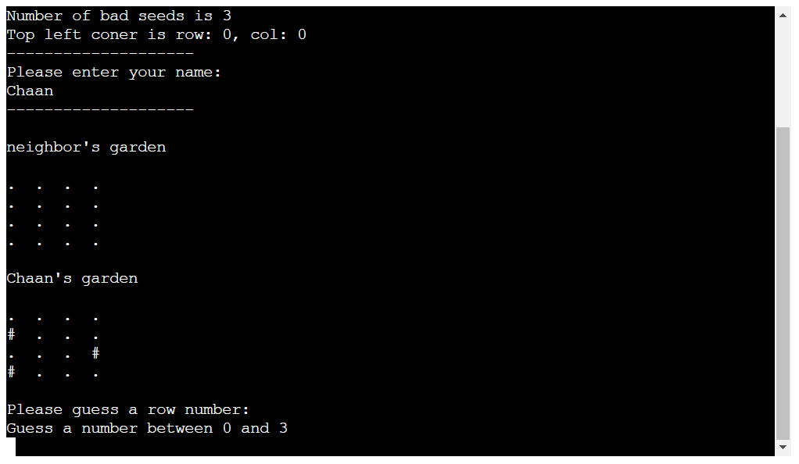
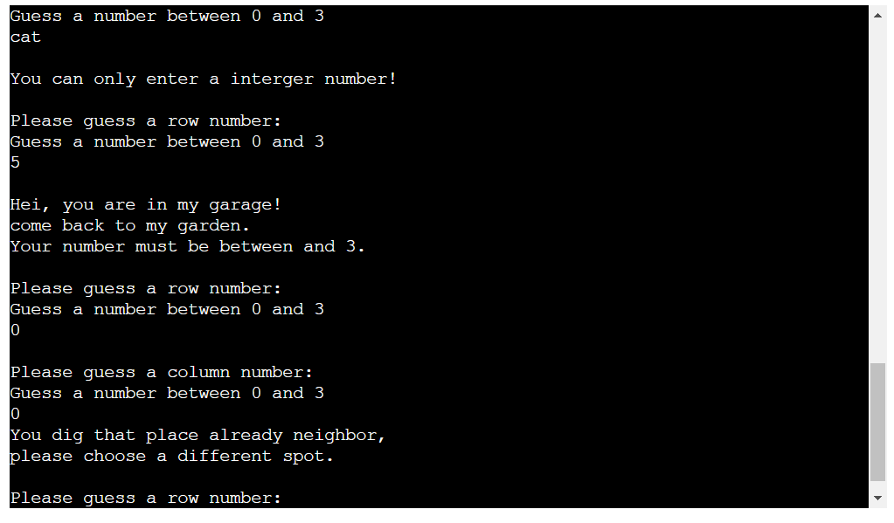

# Help Neighbor-Bad Seeds

Bad seeds is a Python terminal game, a "episode" of the future series game "Help Neighbor", wich runs in the Codeinstitute mock terminal on Heroko.
It's time to help each other instead of killiing or destroy each other. 
Future series could be "Help Ocean", "Help Forest", "Help Mankind", etc.

In this game, player and the neighbor (computer) will help each other to dig out the bad seeds in their garden. Each seed occupies one square on the board.

Here is the live version of my project.
 

 # How to play
 In thsi game, player enter the name, and two boards and the bad seeds are randomly generated. 
 Player can see the bad seeds on his/her side which indicate by a "#" sign, while computer side's bad seeds are hidden.
 Player will be prompt to guess where the bad seeds are by entering row and column number, then computer will randomly generate a coordinate.
 Hit will be marked as "$", score will be incremented accordingly, while miss will be shown as "X".
 Game will automatically stop when one side has dig out all the bad seeds.
 Then the winner will be annouced. Game over.

 # Feature

 ## Existing Feature
 - Random Boards generation
    - Bad Seeds are randomly placed on both player and computer's boards.
    - Computer side of guess coordinate is also randomly generated.
    - Make sure all the random set (row and column) are no duplicates.
    - Play cannot see where the computer's bad seeds are.

- Input Validation
    - The guess row and col must be within the size of grid.
    - Input must be numbers.
    - Play cannot guess the same spot twice.

    Data maitained in class instances

## Futue Feature
- Allow player to select board size and numbers of bad seeds.
- Allow player position the bad seeds themselves.

# Data Model 

- The code use a Board class as model and has two instances to hold the Player and the computer's boards. 
    - The Board class stores the board size, the number of bad seeds, play name and type. 
    - Has methods to print board, creat randdom non repeating numbers for add seeds and computer guess.
    - Has player guess method in which input will be prompt and validated, miss and hit will be marked, and score will be incremented.
    - Has computer playing method which generates random non repeating coordinate, mark miss and hit, and add score.

# Testing

I have manually tested this project by doing the following:
- Passed the code through a PEPS linter and confirmed there are no problems.
- Given invalid inputs: strings when numbers are expected, out of bounds inputs, same coordinate twice • Tati•d in my Local terminal and Ow Coda Instinew Herein. terminal 
